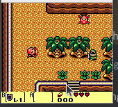

# GGBE

Generic Game Boy Emulator, abbreviated as GGBE, is a cycle accurate Game Boy emulator which strives to not compromise
code quality and readability for the sake of performance. This is a hobby project written as a learning opportunity to
balance readability and performance.

In its current state, the emulator can run DMG games,i.e. it functions as a DMG emulator at the moment.

# Working Games #

[]     
   
  
     

## Running GGBE ##

Requirements:

- A compiler which can compile C++17
- SDL2 development libraries
- CMake should be installed

Move to src directory using

```sh
cd src
```

The GGBE executable can be generated by running the following commands in terminal

```sh
chmod u+x run.sh
./run.sh
```

This should generate the build directory.

The emulator can then be launched by the following command

```sh
 ./build/GGBE <absolute-path-to-rom>/<relative-path-from-root>
```

For example if tetris.gb were in roms directory, the command

```sh
 ./build/GGBE roms/tetris.gb
```

should start up tetris.

The boot rom is taken from https://github.com/Hacktix/Bootix.

## Key Mapping ##

| Game Boy | Key |
| -------- | -------|
| Dpad | Arrow Keys |
| A | Z |
| B | X |
| Select | A |
| Start | S |

## Project Structure ##

The Emulator is planned to be divided into 4 major components as of now:

- CPU : Deals with everything related to instructions and interrupts.
- GPU/PPU : Deals with everything related to getting pixels onto the screen
- APU (work in progress) : Deals with everything related to Audio generation and Mixing
- MMU : Takes care of Memory Mapping and Bank Switching

These components are represented as classes and are consolidated as member objects of a class Console, which represents
the Console itself. This modular approach makes it easy to write and test code.

## Test Suite ##

### Blargg's tests ###

| Test | GGBE |
  | ---- | ------ |
| cpu instrs | :+1: |
| dmg sound | :x: |
| instr timing  | :+1: |
| mem timing | :+1: |
| mem timing 2 | :+1: |

### Mooneye's tests ###

#### Timer ####

| Test | GGBE |
  | ---- | ---- |
| div_write | :+1: |
| rapid_toggle | :+1: |
| tim00 div trigger | :+1: |
| tim00 | :+1: |
| tim01 div trigger | :+1: |
| tim01 | :+1: |
| tim10 div trigger | :+1: |
| tim10 | :+1: |
| tim01 div trigger | :+1: |
| tim01 | :+1: |
| tim11 div trigger | :+1: |
| tim11 | :+1: |
| tima_reload | :+1: |
| tima_write_reloading | :+1: |
| tma_write_reloading | :+1: |

#### MBC ####

#### MBC1

| Test              | GGBE |
| ----------------- |------|
| bits bank1        | :+1: |
| bits bank2        | :+1: |
| bits mode         | :+1: |
| bits ramg         | :+1: |
| rom 512kb         | :+1: |
| rom 1Mb           | :+1: |
| rom 2Mb           | :+1: |
| rom 4Mb           | :+1: |
| rom 8Mb           | :+1: |
| rom 16Mb          | :+1: |
| ram 64kb          | :+1: |
| ram 256kb         | :+1: |
| multicart rom 8Mb | :x:  |

#### MBC2

| Test              | GGBE    |
| ----------------- |------|
| bits ramg         | :+1: |
| bits romb         | :+1: |
| bits unused       | :+1: |
| rom 512kb         | :+1: |
| rom 1Mb           | :+1: |
| rom 2Mb           | :+1: |
| ram               | :+1: |

#### MBC5

| Test              | GGBE |
| ----------------- |------|
| rom 512kb         | :+1: |
| rom 1Mb           | :+1: |
| rom 2Mb           | :+1: |
| rom 4Mb           | :+1: |
| rom 8Mb           | :+1: |
| rom 16Mb          | :+1: |
| rom 32Mb          | :+1: |
| rom 64Mb          | :+1: |
  